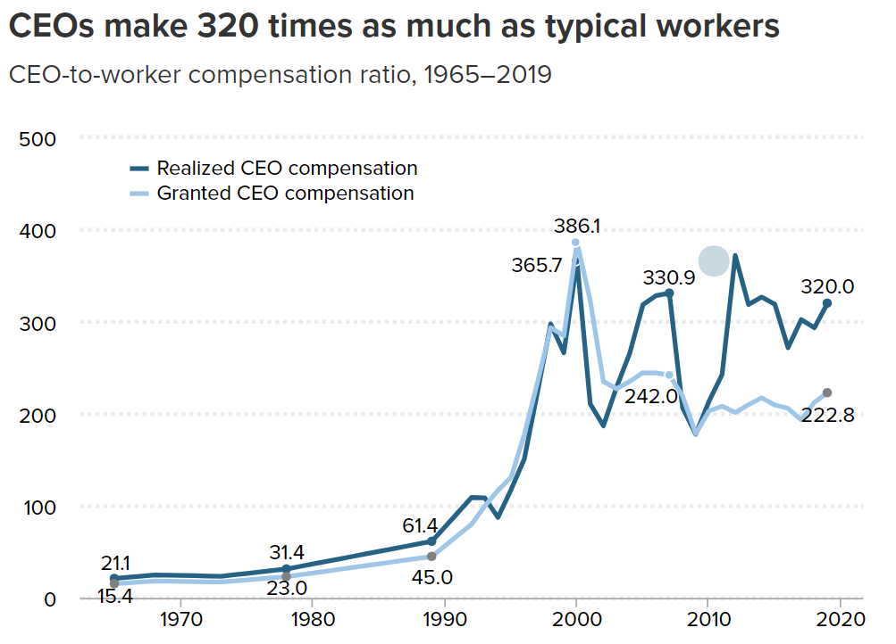

# Critique by Redesign
## Original Visual

Source: [Economic Policy Institute](https://www.epi.org/publication/ceo-compensation-surged-14-in-2019-to-21-3-million-ceos-now-earn-320-times-as-much-as-a-typical-worker/)
I chose this visualization for two reasons. First, it is good, generally speaking. It accurately conveys the information it intends to and backs up the message of the article, all while being aesthetically pleasing (or at least easy on the eye) and intuitive. Redesigning a good visualization is much more difficult that redesigning a bad one. The second reason is that, while it is accurate, I did not think that it did a great job at conveying the magnitude of the disparity between CEOs and typical workers. I wanted to try my hand at something that delivered the same information in a more striking way.

## Critique of the Original
<ins>Usefulness</ins>: 10. This graph is in an article about CEO compensation in the United States and the associated inequality. This graph might be the most practically useful one in the article because it concretely shows the disparity between CEOs and “typical workers”
Completeness: 8. While the emphasis is on the amount made in excess of the typical worker expressed as a ratio, the lack of information on the absolute amount made by typical workers detracts from the graphs completeness. In other words, the comparison is less powerful than it could be because only one side is being shown.
<ins>Perceptibility</ins>: 9. The graph follows all the usual conventions that make line charts easy to read—time goes from left to right on the x-axis, the ratios increase as you travel up the y-axis, each line is a different shade of the same hue, and there are light dotted lines to assist the viewer in understanding where each line matches up with the y-axis. However, the numbers at the selected points on each line in the graph are distracting and perhaps unnecessary. Since the lines intersect at various points, it can be difficult to parse whether one number refers to one line or the other.
<ins>Truthfulness</ins>: 10. The authors are very clear which metrics they are comparing and how they got there (in the caption and other parts of the article). The trendlines reflect the patterns in other data sets present in the article, with some wiggle room considering their methodology was more sophisticated than simply comparing the averages.
<ins>Intuitiveness</ins>: 10. This graph is familiar to laymen and experts alike. Since it follows all the assumed conventions of a line graph, there is practically no possibility for its audience to mistake the meaning of the graph.
<ins>Aesthetic</ins>: 7. The visual is fine for interpretation but does not have any charm outside its informativeness. Yes, grey is our friend when making data visualizations, but even the blues used for each line feel grey—and when everything feels grey, everything feels drab. Although there might not be a lot of room for expressiveness in this rather simple line graph, more striking colors might have been used to prevent a visual lull in an article already dominated by technical text. Also, there is no need to have a dotted line overlapping the x axis to indicate a ratio of X:0 (a ratio which makes no practical sense, I might add).
<ins>Engagement</ins>: 5. As I alluded to before, the graph offers a chance of reprieve from long technical paragraphs filled with numbers, but it fails to capitalize on its own potential by refraining from making a more emphatic statement about the data. There is a tradeoff when using line graphs for information like this: they are intuitive and generally easy to understand, but can be incredibly clinical or boring. While this graphic doesn’t shun the viewer, it does not invite them to engage with the data—instead it serves as a succinct summary. It is a visual aid, not a visual statement, neither inviting nor exclusionary, just there.

