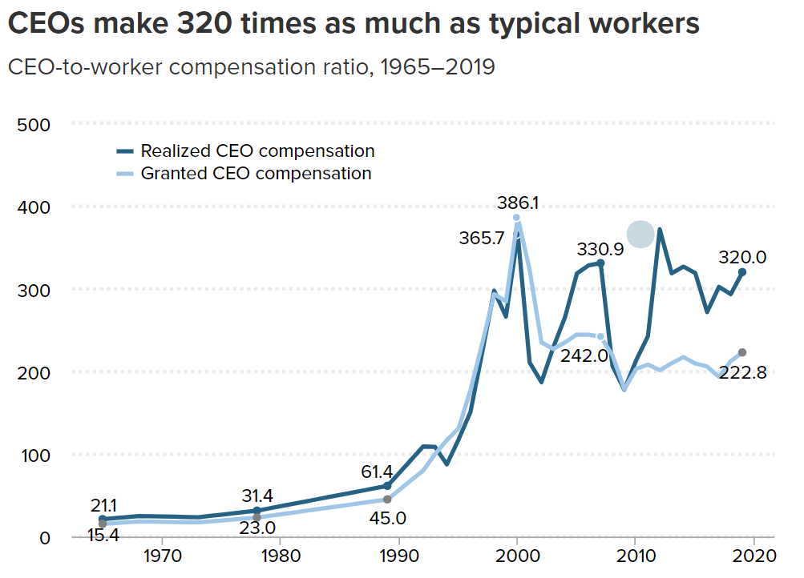
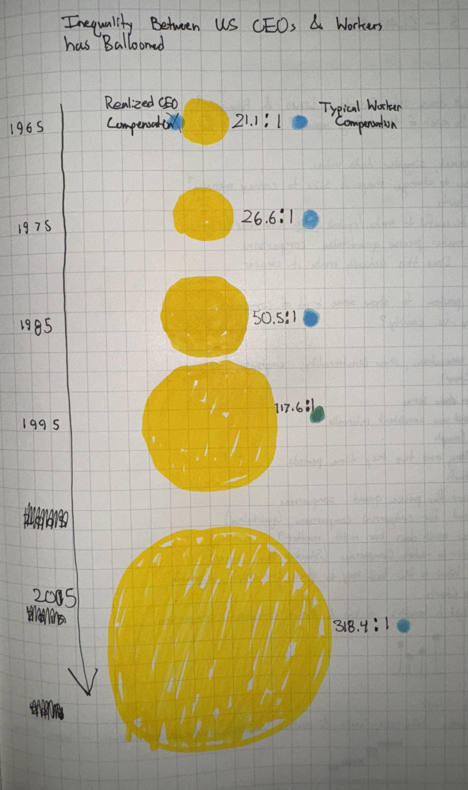

# Critique by Redesign
## Original Visual

Source: [Economic Policy Institute](https://www.epi.org/publication/ceo-compensation-surged-14-in-2019-to-21-3-million-ceos-now-earn-320-times-as-much-as-a-typical-worker/)

I chose this visualization for two reasons. First, it is good, generally speaking. It accurately conveys the information it intends to and backs up the message of the article, all while being aesthetically pleasing (or at least easy on the eye) and intuitive. Redesigning a good visualization is much more difficult that redesigning a bad one. The second reason is that, while it is accurate, I did not think that it did a great job at conveying the magnitude of the disparity between CEOs and typical workers. I wanted to try my hand at something that delivered the same information in a more striking way.

## Critique of the Original
<ins>Usefulness</ins>: 10. This graph is in an article about CEO compensation in the United States and the associated inequality. This graph might be the most practically useful one in the article because it concretely shows the disparity between CEOs and “typical workers”
Completeness: 8. While the emphasis is on the amount made in excess of the typical worker expressed as a ratio, the lack of information on the absolute amount made by typical workers detracts from the graphs completeness. In other words, the comparison is less powerful than it could be because only one side is being shown.

<ins>Perceptibility</ins>: 9. The graph follows all the usual conventions that make line charts easy to read—time goes from left to right on the x-axis, the ratios increase as you travel up the y-axis, each line is a different shade of the same hue, and there are light dotted lines to assist the viewer in understanding where each line matches up with the y-axis. However, the numbers at the selected points on each line in the graph are distracting and perhaps unnecessary. Since the lines intersect at various points, it can be difficult to parse whether one number refers to one line or the other.

<ins>Truthfulness</ins>: 10. The authors are very clear which metrics they are comparing and how they got there (in the caption and other parts of the article). The trendlines reflect the patterns in other data sets present in the article, with some wiggle room considering their methodology was more sophisticated than simply comparing the averages.

<ins>Intuitiveness</ins>: 10. This graph is familiar to laymen and experts alike. Since it follows all the assumed conventions of a line graph, there is practically no possibility for its audience to mistake the meaning of the graph.

<ins>Aesthetic</ins>: 7. The visual is fine for interpretation but does not have any charm outside its informativeness. Yes, grey is our friend when making data visualizations, but even the blues used for each line feel grey—and when everything feels grey, everything feels drab. Although there might not be a lot of room for expressiveness in this rather simple line graph, more striking colors might have been used to prevent a visual lull in an article already dominated by technical text. Also, there is no need to have a dotted line overlapping the x axis to indicate a ratio of X:0 (a ratio which makes no practical sense, I might add).

<ins>Engagement</ins>: 5. As I alluded to before, the graph offers a chance of reprieve from long technical paragraphs filled with numbers, but it fails to capitalize on its own potential by refraining from making a more emphatic statement about the data. There is a tradeoff when using line graphs for information like this: they are intuitive and generally easy to understand, but can be incredibly clinical or boring. While this graphic doesn’t shun the viewer, it does not invite them to engage with the data—instead it serves as a succinct summary. It is a visual aid, not a visual statement, neither inviting nor exclusionary, just there.

## Sketching a Solution
As I previously mentioned, I wanted to create a visualization that did a better job drawing attention to just how mind-boggling the disparity between CEO and workers' compensation is. Moving away from a technical support graphic to a statement piece, this would generally appeal to a different audience. The type of thing I was going for was something that might be published in an online news article.

By using shapes of different size, I thought I could do a better job of conveying that disparity than with a simple line graph. A bar chart could have also sufficed, but I had already decided that I wanted to do something very different, and producing something as foreign as possible definitely could not be done in a bar graph. 

I chose to put time going down because, if it was going left to right, it would put one bubble over the other. The problem with that would be that it implies that one compensation is somehow greater than the other, regardless of size. After drawing, it, I decided that the arrow was entirely unnecessary and scrapped it immediately.

Even when there are only two of them, discerning the difference in size between shapes is difficult, especially for circles. For this reason, I decided to put the ratio of CEO-to-Worker compensation in between the bubbles to make it more clear what the precise comparison was. 

As for the color, yellow and blue are my go-to visualization colors. Next to each other, they are easy to tell apart while carrying no subliminal meaning (unlike, say, green and red).

## Feedback on my Sketch
I interviewed two fellow CMU Heinz students for feedback on my sketch. Overall, it was very positive, and most of what they said were in alignment with one another. Main takeaways are given below.

Student A, 26, MSPPM:

-On first glance, the graphic makes sense. CEO compensation has definitely gotten bigger over the past half-century.

-It might work better horizontally, but keeping it vertical prevents it from looking like one is arbitrarily "better" or "more" because it is positioned higher than the other.

-Typical worker compensation looks like it has not grown at all, which is not true. Is there a way to change this so the proportions grow according to earnings specifically?

-Colors are good, but yellow may be hard to see depending on the hue.

-Keep the numbers unrounded. Specificity is good with quantitative data.

-Many little squares might be better for reflecting ratios.

Student B, 24, MSPPM:

-Using the word ballooned is making a judgement statement. Makes sense for the context.

-Very clear how much the disparity has grown.

-Clarify whether things are adjusted for inflation, if its how much they make a year, and what CEO compensation means exactly.

-On a web page, horizontal might be better so it can take up the whole screen. When its vertical, it might be so huge that you'll want to scroll past it.

-Include the word "ratio" specifically.

-Maybe you should round the numbers.

-Maybe use icons, like squares or little people, instead of circles.

There was a lot of overlap in the feedback. I agreed with them that using icons, either squares or little stick men, might be better at reinforcing the idea of ratios and not pure earnings in dollars. They also both said that the overall idea was very clearly demonstrated by my sketch, and that the shock factor of the disparity was well evoked by the design. However, something I learned was that some people think it is more intuitive (or sensible) orient it horizontally while others would prefer vertically. Similarly, they disagreed on the rounding.

## Final Redesign
I wanted to experiment with the ideas my interviewees brought up, namely using icons instead of circle volume to represent the magnitude of the ratio. However, I am not skilled enough with Tableau to fully implement these ideas. I ended up creating what is mostly the same graphic, since most of the feedback was positive.

<noscript></noscript><object class='tableauViz'  style='display:none;'><param name='host_url' value='https%3A%2F%2Fpublic.tableau.com%2F' /> <param name='embed_code_version' value='3' /> <param name='site_root' value='' /><param name='name' value='CEOCompensation_17072810368400&#47;Sheet1' /><param name='tabs' value='no' /><param name='toolbar' value='yes' /><param name='static_image' value='https:&#47;&#47;public.tableau.com&#47;static&#47;images&#47;CE&#47;CEOCompensation_17072810368400&#47;Sheet1&#47;1.png' /> <param name='animate_transition' value='yes' /><param name='display_static_image' value='yes' /><param name='display_spinner' value='yes' /><param name='display_overlay' value='yes' /><param name='display_count' value='yes' /><param name='language' value='en-US' /><param name='filter' value='publish=yes' /></object>

In the future, I will experiment with label placement and icon generation. I truly believe that using icons, as per the feedback, would make the ratios over the years much more clear, let alone intuitive, than circles. I would have also liked for there to be a single pane/window for my visualization, where you could use the scroll wheel to see icons added and subtracted as you scroll through different years. Later, I will try to re-recreate this so I can better realize my ideas.
