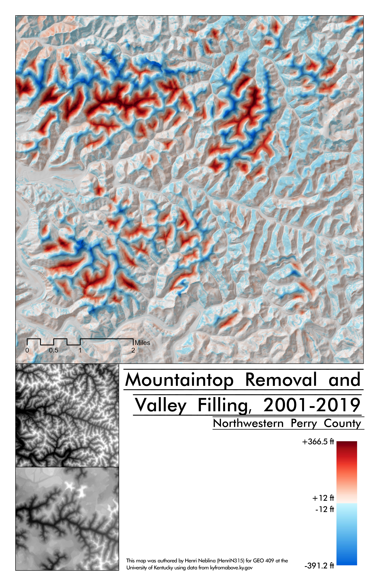

# Mining-in-Eastern-Kentucky
# Northwestern Perry County
## Mountaintop removal and valley filling have dramatically altered the landscape in the area.

Over the course of nearly two decades, the mountainous landscape in Perry County has been largely flattened by coal mining operations. Valleys have been filled with soil and raised by up to 391 feet, while mountaintops have been flattened with some being lowered 366 ft. Such drastic alterations have a profound impact on the areas wildlife and makes permanent changes to the land on which the ecosystem depends.

     
*Mountaintop removal and valley filling in NW Perry County*

## [Link to high-resolution version](perrymining.pdf)     

Map and repository created by Henri Neblina (HenriN315) using data from kyfromabove.ky.gov
