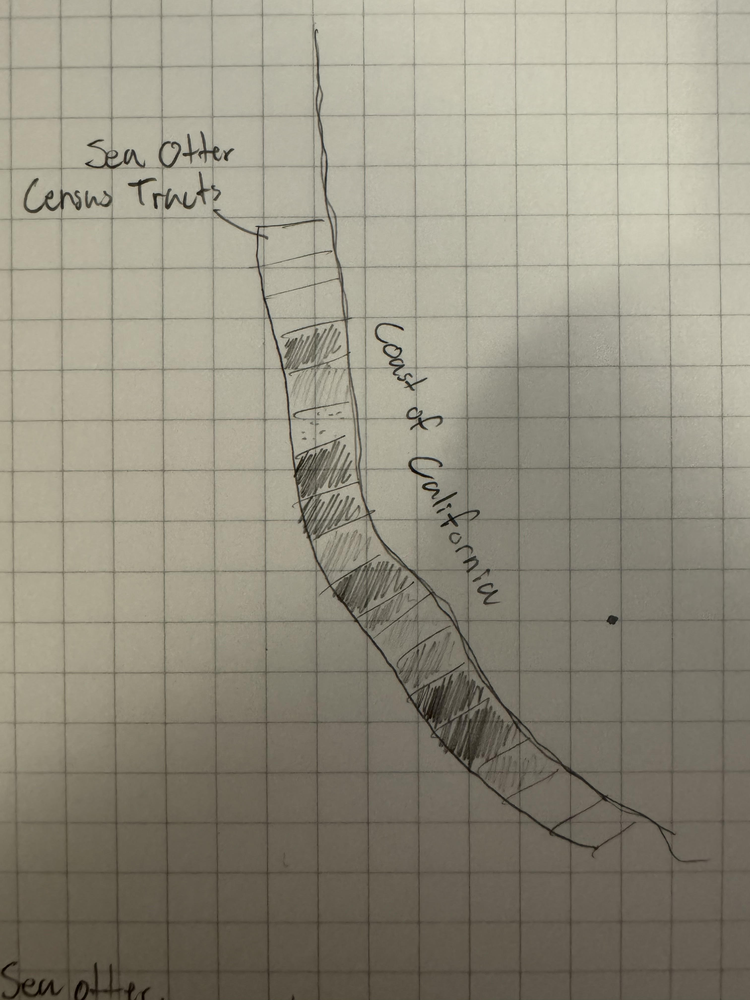
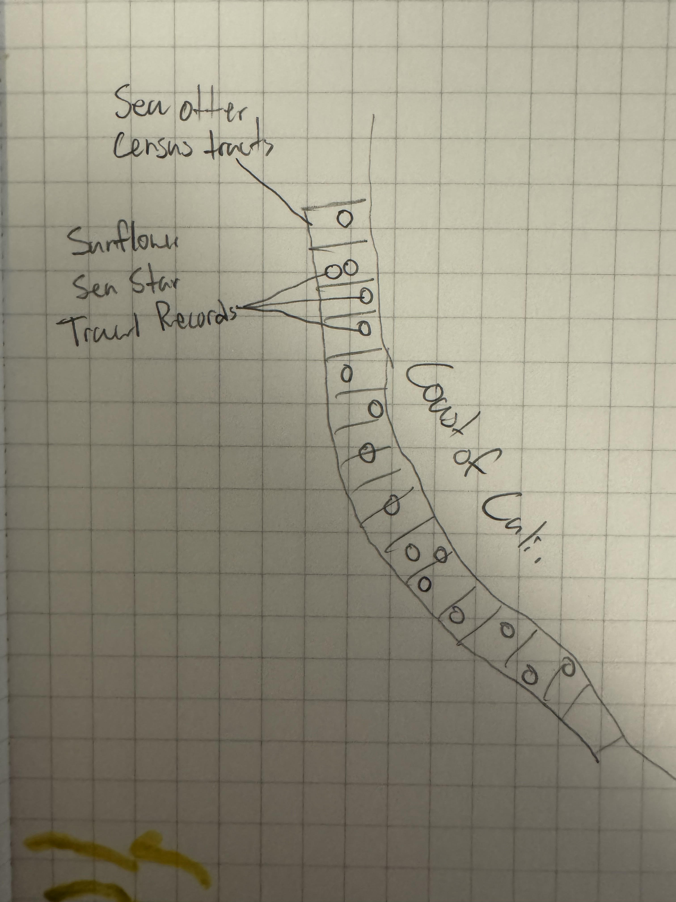
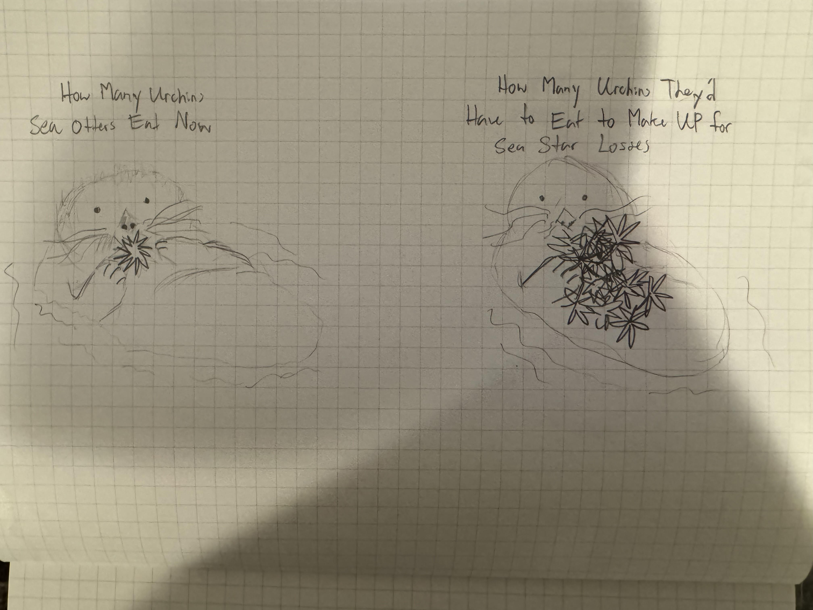

# Final Project Part 1
## Intro and Outline
At first, I wanted to tell a story about the importance of predators in ecosystems and how they intersect with human life. I was going to pick a few predators--some more well known (grey wolves, otters) than others (martens, sunflower sea stars, wolverines)--and document how changes in their population and distribution change the ecosystem and landscape.

However, I quickly learned that it isn't easy to come by detailed geographic data about species people don't care about. So instead, I will be focusing on an environment that is comparatively well-studied: kelp forests off the coast of California. 

I am interested in showing the overall health of kelp forests over time. I want to do so by proxy, highlighting the health of two keystone predators, sea otters and sunflower sea stars, and how they interrelate with kelp forest abundance overall. I expect to see that as otter populations rise from the mid-1980s into the 2010s ([Tinker & Hatfield, 2016](https://pubs.usgs.gov/ds/1018/ds1018.pdf)), kelp forests will grow or remain the same size, but after the sunflower sea star wasting syndrome killed roughly 90% of the population ([Gravem et al., 2021](https://dx.doi.org/10.2305/IUCN.UK.2021-1.RLTS.T178290276A197818455.en.)) they will shrink. I want to show how this is because of how the otters and sea stars (as well as other urchin-eating predators) regulate the dynamic between kelp forests and urchins.

Since urchins feed on kelp, predation is required to ensure that urchins do not overgraze and destroy kelp forests entirely. When otter and sunflower sea star populations are at relatively normal levels, kelp forests may fluctuate in size and density but remain stable on average. Since the 1980s, sea otters have been a central focus of marine conservationists, both for their own sake and for the sake of preserving kelp forests. However, in absence of the sunflower sea star (Pycnopodia helianthoides) they are unable to singelhandedly prevent a trophic cascade within kelp ecosystems, leading to the rapid replacement of kelp forests with urchin barrens ([Joshua et al., 2021](https://doi.org/10.1073/pnas.2012493118)). This, in combination with warming waters due to climate change ([Roggers-Bennett & Catton, 2019](https://doi.org/10.1038/s41598-019-51114-y)), has significantly reduced the biomass of kelp forest.

## Initial Sketches

For this first sketch, I want to take the annual Sea Otter Census Tract data and make a diverging heat map. Just picking two colors, orange could represent tracts where otter populations have decreased since the begining of the census and blue could represent tracts where their populations have increased.

To add onto the first sketch, I would also like to join trawl record data of sunflower star fish and (not included in sketch) raster data for aerial kelp forest surveys to see what patterns emerge. As per [Joshua et al. (2021)](https://doi.org/10.1073/pnas.2012493118), I expect to see kelp forests hanging on where otter census tracts contain high densities of sea otter population.

I also want to do something a bit more dramatic, a bit more in-your-face to demonstrate the scale of the urchin barrens. Here, we have an otter eating what they would normally eat on the left, and on the right is what that otter would have to eat to make up for the missing star fish. With this I hope to demsontrate not only the magnitude of the problem but also that ecosystems, while often resilient, are also sensetive to the removal of key ecological regulators.

### References
Gravem, S. A., Heady, W. N., Saccomanno, V. R., Alvstad, K. F., Gehman, A. L. M., Frierson, T. N. & Hamilton, S.L. 2021. *Pycnopodia helianthoides (amended version of 2020 assessment)*. The IUCN Red List of Threatened Species 2021: e.T178290276A197818455. https://dx.doi.org/10.2305/IUCN.UK.2021-1.RLTS.T178290276A197818455.en.

Joshua, G. S, Tomoleoni, J., Staedler, M., Lyon, S., Fujii, J. & Tinker, M. T. (2021) Behavioral responses across a mosaic of ecosystem states restructure a sea otter–urchin trophic cascade. *Proceedings of the National Adacemy of Sciences, 118*(11). https://doi.org/10.1073/pnas.2012493118

Rogers-Bennett, L., Catton, C. A. (2019) Marine heat wave and multiple stressors tip bull kelp forest to sea urchin barrens. *Scientific Reports 9, 15050*. https://doi.org/10.1038/s41598-019-51114-y

Tinker, M. T. & Hatfield, B. B. (2016) *California sea otter (enhydra lutris nereis) census results, spring 2016*. US Geological Survey. https://pubs.usgs.gov/ds/1018/ds1018.pdf
